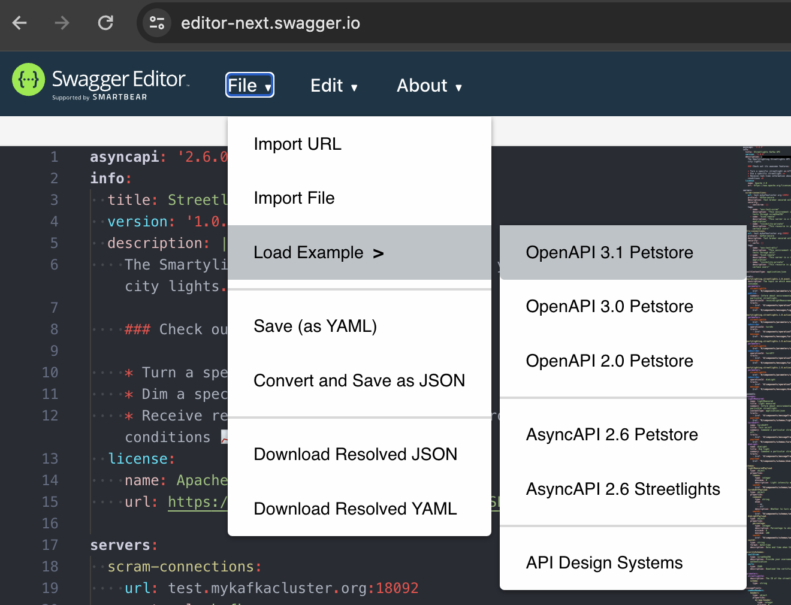

Software Architecture & Design
# API Documentation
Specification and documentation of a systems Application Programming Interface (API) are essential to any architecture documentation and serve multiple stakeholders.

In this exercise, you will work with OpenAPI specification language to study and experiment with the specification of a RESTful API of a simple PetStore service, use Swagger UI to generate interactive web-based documentation, and Swagger Codegen to generate a fully functional mock server.

1. [Familiarize Yourself with the Swagger Toolset](#familiarize-yourself-with-the-swagger-toolset)
    1. [Use Swagger Editor](#use-swagger-editor)
    2. [Spin Up Your Own API Server from Swagger's Mock Servers](#spin-up-your-own-api-server-from-swaggers-mock-servers)
    3. [Learn Key Features of the Specification Language](#learn-key-features-of-the-specification-language)
---

# Familiarize Yourself with the Swagger Toolset
https://swagger.io/

Swagger is a set of open-source tools and specifications for designing, building, documenting, and consuming RESTful APIs (Application Programming Interfaces). The Swagger Toolset, now known as the OpenAPI Initiative, provides a range of tools to simplify API development and maintenance processes.

The three primary Swagger tools are:

1. **Swagger Editor**: It's an open-source editor that allows developers to write OpenAPI (formerly known as Swagger) specifications in either YAML or JSON format. The editor provides features like syntax highlighting, auto-completion, and error checking, making it easier to create and edit API documentation.

2. **Swagger UI**: Swagger UI is a web-based tool that dynamically generates interactive API documentation from an OpenAPI specification. It provides a user-friendly interface for developers and consumers to explore and test APIs directly in the browser. Swagger UI displays information such as available endpoints, request parameters, response schemas, and example requests and responses.

3. **Swagger Codegen**: Swagger Codegen is a code generation tool that automatically generates server stubs and client SDKs (Software Development Kits) from an OpenAPI specification. It supports various programming languages and frameworks, allowing developers to quickly bootstrap API implementations and client libraries without manually writing boilerplate code.

Overall, the Swagger Toolset simplifies API development by providing a standardized approach to designing, documenting, and consuming APIs. It promotes consistency, collaboration, and automation, ultimately speeding up the development process and improving the quality of APIs.

## Use Swagger Editor
https://editor-next.swagger.io

> <small>_Note: Swagger's older editor can be found at https://editor.swagger.io_</small>

We are going to use the **Swagger Petstore** files for this exercise.

You can load this example file in the [Swagger Editor](https://editor-next.swagger.io) by clicking on **File**, then **Load Example**, and then **OpenAPI 3.1 Petstore**.

You can download a copy of the 3.1 yaml file from: [openapi3_1.yaml](./petstore/docs/openapi3_1.yaml)

## Spin Up Your Own API Server from Swagger's Mock Servers
Try spinning up your own API server from the mock servers available in Swagger.

### 1️⃣ Generate the Mock Server
Generate and download a mock server from **Petstore 3.1** of your choice using the **Generate Server** tab. _Swagger can generate various types of servers, including `Java-based`, `Python-flask`, `nodejs-server`, and many more._

### 2️⃣ Start the Mock Server
The downloaded mock server contains a `README` file. Follow the instructions in the `README` file to run a local instance of the mock server. The server binds to a local port and can be used to invoke all functions specified in your API specification.

### 3️⃣ Observe Running in Localhost
Observe the localhost URL in the address bar and the Swagger documentation in the browser viewer.

## Learn Key Features of the Specification Language
Let's explore the API by doing the following steps.

1. Discover a valid **available** `PET ID` using the `/pet/findByStatus` (**GET**) endpoint.
2. Invoke the `/pet/{petId}` (**GET**) endpoint using the `PET ID` from step 1 above.
3. Place an order for your pet using the endpoint `/store/order` (**POST**) and your `PET ID` from step 1. Look at the response body and make note of your `ORDER ID` (note that you entered in the `ORDER ID` in your request body).
4. Using `/store/order/{orderId}`, show the response body of your order in the system.